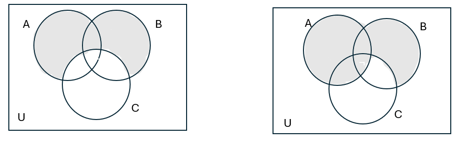
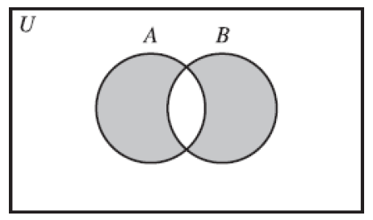

## Introduction {.unnumbered}

## Sentential Logic

### Deductive Reasoning and Logical Connectives {#1.1}

#### 1.

(a) We’ll have either a reading assignment or homework problems, but we won’t have both homework problems and a test.

    -   R: We’ll have a reading assignment.
    -   P: We’ll have homework problems.
    -   T: We’ll have a test.

    $(R \lor P) \land (\neg P \lor \neg T)$ or $\neg(P \land T)$.

(b) You won’t go skiing, or you will and there won’t be any snow.

    -   SK: You'll go skiing.
    -   SN: There will be snow.

    $\neg SK \lor (SK \land \neg SN)$.

(c) $\sqrt{7} \not\leq 2$.

    $\neg((\sqrt{7} < 2) \lor (\sqrt{7} = 2))$.

#### 2.

(a) Either John and Bill are both telling the truth, or neither of them is.

    -   J: John is telling the truth.
    -   B: Bill is telling the truth.

    $(J \land B) \lor (\neg J \land \neg B)$ or $\neg(J \lor B)$.

(b) I’ll have either fish or chicken, but I won’t have both fish and mashed potatoes.

    -   F: I'll have fish.
    -   C: I'll have chicken.
    -   P: I'll have mashed potatoes.

    $(F \lor C) \land \neg (F \land P)$.

(c) 3 is a common divisor of 6, 9, and 15.

    $(3 \mid 6) \land (3 \mid 9) \land (3 \mid 15)$.

#### 3.

-   A: Alice is in the room.
-   B: Bob is in the room.

(a) Alice and Bob are not both in the room. $\neg A \lor \neg B$
(b) Alice and Bob are both not in the room. $\neg A \land \neg B$
(c) Either Alice or Bob is not in the room. $\neg A \lor \neg B$
(d) Neither Alice nor Bob is in the room. $\neg A \land \neg B$

#### 4.

-   RT: Ralph is tall.
-   ET: Ed is tall.
-   RH: Raph is handsome.
-   EH: Ed is handsome.

(a) Either both Ralph and Ed are tall, or both of them are handsome. $(RT \land ET) \lor (RH \land EH)$.

(b) Both Ralph and Ed are either tall or handsome. $(RT \lor RH) \land (ET \lor EH)$.

(c) Both Ralph and Ed are neither tall nor handsome. $\neg((RT \lor RH) \land (ET \lor EH))$.[^1]

(d) Neither Ralph nor Ed is both tall and handsome. $\neg((RT \land RH) \lor (ET \land EH))$.

[^1]: need to check c and d

::: callout-note
-   Not both A and B = Not A or Not B.
-   Neither A nor B = Not A and Not B.
:::

#### 5.

(a) ¬(¬P ∨ ¬¬R). --\> This is a well-formed formula.
(b) ¬(P, Q, ∧ R).
(c) P ∧ ¬ P. --\> This is a well-formed formula.
(d) (P ∧ Q)(P ∨ R).

#### 6.

Let P stand for the statement “I will buy the pants” and S for the statement “I will buy the shirt.”

(a) ¬(P ∧ ¬S). Either I will not buy the pants, or I will buy the shirt.

(b) ¬P ∧ ¬S. I will neither buy the pants nor buy the shirt.

(c) ¬P ∨ ¬S. Either I will not buy the pants, or I will not buy the shirt. I will not buy both the pants and the shirt.

#### 7.

Let S stand for the statement “Steve is happy” and G for “George is happy.” What English sentences are represented by the following formulas?

(a) (S ∨ G) ∧ (¬ S ∨ ¬G). Either Steve is happy or George is happy, but they are not both happy.

(b) \[S ∨ (G ∧ ¬S)\] ∨ ¬G. There are three posibilities, (i) Steve is happy, or (ii) George is happy and Steve is not happy, or (iii) George is not happy.[^2]

(c) S ∨ \[G ∧ (¬ S ∨ ¬G)\]. Either Steve is happy, or George is happy but they are not both happy.[^3]

[^2]: ???

[^3]: Is this just (a)?

#### 8.

Let T stand for the statement “Taxes will go up” and D for “The deficit will go up.” What English sentences are represented by the following formulas?

(a) T ∨ D. Either taxes will go up or the deficit will go up.

(b) ¬(T ∧ D) ∧ ¬(¬T ∧ ¬D). Taxes and deficit will not both go up, but either taxes will go up or deficit will go up.

(c) (T ∧ ¬ D)∨ (D ∧ ¬T). Either taxes will go up and deficit will not go up, or deficit will go up and taxes will not go up.

#### 9.

::: callout-note
## Valid Argument

An argument is valid if the premises cannot all be true without the conclusion being true as well.
:::

(a) Jane and Pete won’t both win the math prize. Pete will win either the math prize or the chemistry prize. Jane will win the math prize Therefore, Pete will win the chemistry prize.

    -   JM: Jane will win the math prize.
    -   PM: Pete will win the math prize.
    -   JC: Jane will win the chemistry prize.
    -   PC: Pete will win the chemistry prize.
        -   $\neg JM \lor \neg PM.$
        -   \$\$ $PM \lor PC.$
        -   $JM.$
        -   Therefore, $PC$.

    This is a valid argument.

(b) The main course will be either beef or fish. The vegetable will be either peas or corn. We will not have both fish as a main course and corn as a vegetable. Therefore, we will not have both beef as a main course and peas as a vegetable.

    -   MB: The main course will be beef.

    -   MF: The main course will be fish.

    -   VP: The vegetable will be peas.

    -   VC: The vegetable will be corn.

        -   $MB \lor MF.$
        -   $VP \lor VC.$
        -   $\neg MF \lor \neg VC.$
        -   Therefore, $\neg MB \lor \neg VP.$

    This is an invalid argument. Two conclusions: (1) $MB \land (VP \lor VC).$ and (2) $(MB \lor MF) \land VP.$

(c) Either John or Bill is telling the truth. Either Sam or Bill is lying. Therefore, either John is telling the truth or Sam is lying.

    -   J: John is telling the truth.

    -   B: Bill is telling the truth.

    -   S: Sam is telling the truth.

        -   $J \lor B.$
        -   $\neg S \lor \neg B.$
        -   Therefore, $J \lor \neg S$.

    This is an invalid argument. If \$ J, then S\$, or if $B, then \neg S$.

(d) Either sales will go up and the boss will be happy, or expenses will go up and the boss won’t be happy. Therefore, sales and expenses will not both go up.

    -   S: Sales will go up.

    -   B: The boss will be happy.

    -   E: Expenses will go up.

        -   $(S \land B) \lor (E \land \neg B)$.
        -   Therefore, $\neg S \lor \neg E$. This is a valid argument. If $S \land B$, then $\neg E \land B$ or not E or B, same for the latter , or if $E \land \neg B$, then $\neg S \land \neg B$.

### Truth Tables

#### 1.

Make truth tables for the following formulas:

(a) 

    | $P$ | $Q$ | $\neg P \lor Q$ |
    |-----|-----|-----------------|
    | T   | T   | F **T**         |
    | T   | F   | F **F**         |
    | F   | T   | T **T**         |
    | F   | F   | T **T**         |

(b) 

    | $S$ | $G$ | $(S \lor G) \land (\neg S \lor \neg G)$ |
    |-----|-----|-----------------------------------------|
    | T   | T   | T **F** F F F                           |
    | T   | F   | T **T** F T T                           |
    | F   | T   | T **T** T T F                           |
    | F   | F   | F **F** T T T                           |

#### 2.

Make truth tables for the following formulas:

(a) ¬\[P ∧ (Q ∨ ¬P)\].

    | P   | Q   | ¬\[P ∧ (Q ∨ ¬P)\] |
    |-----|-----|-------------------|
    | T   | T   | **F** T T F       |
    | T   | F   | **T** F F F       |
    | F   | T   | **T** F T T       |
    | F   | F   | **T** F T T       |

(b) (P ∨ Q) ∧ (¬ P ∨ R).

    | P   | Q   | R   | (P ∨ Q) ∧ (¬ P ∨ R) |
    |-----|-----|-----|---------------------|
    | T   | T   | T   | T **T** F T         |
    | T   | T   | F   | T **F** F F         |
    | T   | F   | T   | T **T** F T         |
    | T   | F   | F   | T **F** F F         |
    | F   | T   | T   | T **T** T T         |
    | F   | T   | F   | T **T** T T         |
    | F   | F   | T   | F **F** T T         |
    | F   | F   | F   | F **F** T T         |

#### 3.

::: callout-note
## Exclusive Or

Using the symbol **+** to mean *exclusive or*, **P + Q** means “**P or Q, but not both**.”

| P     | Q     | P + Q |
|-------|-------|-------|
| **T** | **T** | **F** |
| T     | F     | T     |
| F     | T     | T     |
| F     | F     | F     |

In mathematics, or always means inclusive or, unless specified otherwise, so **∨** means *inclusive or*.
:::

(b) Find a formula using only the connectives ∧, ∨, and ¬ that is equivalent to P + Q. Justify your answer with a truth table.

    | P   | Q   | P + Q | We need | P ∨ Q | ¬ (P ∧ Q) | (P ∨ Q) ∧ ¬ (P ∧ Q) |
    |-----|-----|-------|---------|-------|-----------|---------------------|
    | T   | T   | F     | T ∧ F   | T     | F T       | F                   |
    | T   | F   | T     | T ∧ T   | T     | T F       | T                   |
    | F   | T   | T     | T ∧ T   | T     | T F       | T                   |
    | F   | F   | F     | F ∧ T   | F     | T F       | F                   |

#### 4.

Find a formula using only the connectives ∧ and ¬ that is equivalent to P ∨ Q. Justify your answer with a truth table.

| P   | Q   | P ∨ Q | Not both false ¬(¬P ∧ ¬Q) |
|-----|-----|-------|---------------------------|
| T   | T   | T     | **T** F F F               |
| T   | F   | T     | **T** F F T               |
| F   | T   | T     | **T** T F F               |
| F   | F   | F     | **F** T T T               |

#### 5.

Some mathematicians use the symbol ↓ to mean nor. In other words, **P ↓ Q** means “**neither P nor Q**.”

(a) Make a truth table for P ↓ Q.

    | P   | Q   | P ↓ Q equivalent to ¬P ∧ ¬Q |
    |-----|-----|-----------------------------|
    | T   | T   | F                           |
    | T   | F   | F                           |
    | F   | T   | F                           |
    | F   | F   | T                           |

<!-- -->

b.  Find a formula using only the connectives ∧, ∨, and ¬ that is equivalent to P ↓ Q.

    ¬P ∧ ¬Q, equivalent to ¬(P ∨ Q).

c.  Find formulas using only the connective ↓ that are equivalent to ¬P, P ∨ Q, and P ∧ Q.

    -   ¬P = ¬(P ∨ P) = P ↓ P.
    -   P ∨ Q = ¬(¬P ∧ ¬Q) = ¬(P ↓ Q) = (P ↓ Q) ↓ (P ↓ Q)
    -   P ∧ Q = ¬(¬P ∨ ¬Q) = ¬((P ↓ P) ∨ (Q ↓ Q)) = (P ↓ P) ↓ (Q ↓ Q).

#### 6.

Some mathematicians write **P \| Q** to mean “**P and Q are not both true**.” (This connective is called *nand*, and is used in the study of circuits in computer science.)

\(a\) Make a truth table for P \| Q.

| P   | Q   | P \| Q equivalent to ¬(P ∧ Q), ¬P ∨ ¬Q |
|-----|-----|----------------------------------------|
| T   | T   | F                                      |
| T   | F   | T                                      |
| F   | T   | T                                      |
| F   | F   | T                                      |

\(b\) Find a formula using only the connectives ∧, ∨, and ¬ that is equivalent to P \| Q.

```         
¬(P ∧ Q), ¬P ∨ ¬Q.
```

\(c\) Find formulas using only the connective \| that are equivalent to ¬P, P ∨ Q, and P ∧ Q.

```         
 ¬P = ¬(P ∧ P) = P \| P
 
 P ∨ Q = ¬(¬P ∧ ¬Q) = ¬(P \| P ∧ Q \| Q) = (P \| P) \| (Q \| Q)
 
 P ∧ Q = ¬(¬P ∨ ¬Q) = ¬(P \| Q) = (P \| Q) \| (P \| Q)
 
 *test this with the truth table*
```

#### 7.

Use truth tables to determine whether or not the arguments in exercise 9 of Section 1.1 are valid.

**An argument is valid if the premises cannot all be true without the conclusion being true as well.**

(a) Jane and Pete won’t both win the math prize. Pete will win either the math prize or the chemistry prize. Jane will win the math prize. Therefore, Pete will win the chemistry prize.

-   JM: Jane will win the math prize.

-   PM: Pete will win the math prize.

-   JC: Jane will win the chemistry prize.

-   PC: Pete will win the chemistry prize.

    -   $\neg JM \lor \neg PM.$
    -   $PM \lor PC.$
    -   $JM.$
    -   $\therefore PC$.

    This is a valid argument.

    | JM    | PM  | JC  | PC              | ¬JM ∨ ¬PM | PM ∨ PC |          |
    |-------|-----|-----|-----------------|-----------|---------|----------|
    | **T** | T   | T   | [T]{.underline} | **F**     | **T**   |          |
    | **T** | T   | T   | [F]{.underline} | **F**     | **T**   |          |
    | **T** | T   | F   | [T]{.underline} | **F**     | **T**   |          |
    | **T** | T   | F   | [F]{.underline} | **F**     | **T**   |          |
    | **T** | F   | T   | [T]{.underline} | **T**     | **T**   | All true |
    | **T** | F   | F   | [T]{.underline} | **T**     | **T**   | All true |
    | **T** | F   | T   | [F]{.underline} | **T**     | **F**   |          |
    | **T** | F   | F   | [F]{.underline} | **T**     | **F**   |          |
    | **F** | T   | T   | [T]{.underline} | **T**     | **T**   |          |
    | **F** | T   | T   | [F]{.underline} | **T**     | **T**   |          |
    | **F** | T   | F   | [T]{.underline} | **T**     | **T**   |          |
    | **F** | T   | F   | [F]{.underline} | **T**     | **T**   |          |
    | **F** | F   | T   | [T]{.underline} | **T**     | **T**   |          |
    | **F** | F   | F   | [T]{.underline} | **T**     | **T**   |          |
    | **F** | F   | T   | [F]{.underline} | **T**     | **F**   |          |
    | **F** | F   | F   | [F]{.underline} | **T**     | **F**   |          |

(b) The main course will be either beef or fish. The vegetable will be either peas or corn. We will not have both fish as a main course and corn as a vegetable. Therefore, we will not have both beef as a main course and peas as a vegetable.

-   MB: The main course will be beef.

-   MF: The main course will be fish.

-   VP: The vegetable will be peas.

-   VC: The vegetable will be corn.

    -   $MB \lor MF.$
    -   $VP \lor VC.$
    -   $\neg MF \lor \neg VC.$
    -   Therefore, $\neg MB \lor \neg VP.$

    This is an invalid argument.

| MB | MF | VP | VC | MB ∨ MF | VP ∨ VC | ¬MF ∨ ¬VC | ¬MB ∨ ¬VP |   |
|--------|--------|--------|--------|--------|--------|--------|--------|--------|
| T | T | T | [T]{.underline} | **T** | **T** | **F** | [F]{.underline} |  |
| T | T | T | [F]{.underline} | **T** | **T** | **T** | [F]{.underline} | False conclusion |
| T | T | F | [T]{.underline} | **T** | **T** | **F** | [T]{.underline} |  |
| T | T | F | [F]{.underline} | **T** | **F** | **T** | [T]{.underline} |  |
| T | F | T | [T]{.underline} | **T** | **T** | **T** | [F]{.underline} | False conclusion |
| T | F | F | [T]{.underline} | **T** | **T** | **T** | [T]{.underline} | All true |
| T | F | T | [F]{.underline} | **T** | **T** | **T** | [F]{.underline} | False conclusion |
| T | F | F | [F]{.underline} | **T** | **F** | **T** | [T]{.underline} |  |
| F | T | T | [T]{.underline} | **T** | **T** | **F** | [T]{.underline} |  |
| F | T | T | [F]{.underline} | **T** | **T** | **T** | [T]{.underline} | All true |
| F | T | F | [T]{.underline} | **T** | **T** | **F** | [T]{.underline} |  |
| F | T | F | [F]{.underline} | **T** | **F** | **T** | [T]{.underline} |  |
| F | F | T | [T]{.underline} | **F** | **T** | **T** | [T]{.underline} |  |
| F | F | F | [T]{.underline} | **F** | **T** | **T** | [T]{.underline} |  |
| F | F | T | [F]{.underline} | **F** | **T** | **T** | [T]{.underline} |  |
| F | F | F | [F]{.underline} | **F** | **F** | **T** | [T]{.underline} |  |

(c) Either John or Bill is telling the truth. Either Sam or Bill is lying. Therefore, either John is telling the truth or Sam is lying.

(d) Either sales will go up and the boss will be happy, or expenses will go up and the boss won’t be happy. Therefore, sales and expenses will not both go up.

#### 9.

::: callout-note
## Tautologies & Contradictions

Formulas that are always true, such as P ∨ ¬P, are called tautologies.

Similarly, formulas that are always false are called contradictions. For example, P ∧ ¬P is a contradiction.
:::

(a) (P ∨ Q) ∧ (¬ P ∨ ¬Q). Neither.

(b) (P ∨ Q) ∧ (¬ P ∧ ¬Q). Contradiction.

(c) (P ∨ Q) ∨ (¬ P ∨ ¬Q). Tautology.

| P | Q | P ∨ Q | ¬ P ∨ ¬Q | a\. (P ∨ Q) ∧ (¬ P ∨ ¬Q) | ¬ P ∧ ¬Q | b\. (P ∨ Q) ∧ (¬ P ∧ ¬Q). | c\. (P ∨ Q) ∨ (¬ P ∨ ¬Q). |
|---------|---------|---------|---------|---------|---------|---------|---------|
| T | T | T | F | F | F | F | T |
| T | F | T | T | T | F | F | T |
| F | T | T | T | T | F | F | T |
| F | F | F | T | F | T | F | T |

(d) \[P ∧ (Q ∨ ¬R)\] ∨ (¬P ∨ R). Tautology.

| P   | Q   | R   | \[P ∧ (Q ∨ ¬R)\] ∨ (¬P ∨ R) |
|-----|-----|-----|-----------------------------|
| T   | T   | T   | T T **T** T                 |
| T   | T   | F   | T T **T** F                 |
| T   | F   | T   | F F **T** T                 |
| T   | F   | F   | T T **T** F                 |
| F   | T   | T   | F T **T** T                 |
| F   | T   | F   | F T **T** T                 |
| F   | F   | T   | F F **T** T                 |
| F   | F   | F   | F T **T** T                 |

#### 12.

Use the laws stated in the text to find simpler formulas equivalent to these formulas. (See Examples 1.2.5 and 1.2.7.)

(a) 

$$ 
\begin{align}
& \neg (\neg P \lor Q) \lor (P \land \neg R) \\
&= (\neg \neg P \land \neg Q) \lor (P \land \neg R) \text{ De Morgan}\\
&= (P \land \neg Q) \lor (P \land \neg R) \text{ double negative} \\
&= P  \land (\neg Q \lor \neg R) \text{ inverse of distributive} \\
&= P \land \neg(Q \land R) \text{ De Morgan} \\
\end{align}
$$

(b) 

$$
\begin{align}
& \neg (\neg P \land Q) \lor (P \land \neg R) \\
&= (\neg \neg P \lor \neg Q) \lor (P \land \neg R) \text{ De Morgan}\\
&= (P \lor \neg Q) \lor (P \land \neg R) \text{ double negative} \\
&= P \lor (P \land \neg R) \lor \neg Q \text{ associative} \\
&= P  \lor \neg Q \text{ absorption} \\
\end{align}
$$

(c) 

$$
\begin{align}
& (P \land R) \lor [\neg R\land (P \lor Q)] \\
&= (P \land R) \lor [(\neg R\land P) \lor (\neg R \land Q)] \text{ distributive}\\
&= (P \land R) \lor (\neg R\land P) \lor (\neg R \land Q) \text{ commutative}\\
&= (P \land (R \lor \neg R)) \lor (\neg R \land Q) \text{ distributive}\\
&= P \lor (\neg R \land Q) \text{ tautology}\\
\end{align}
$$

### Variables and Sets

#### 1.

Analyze the logical forms of the following statements:

(a) 3 is a common divisor of 6, 9, and 15. (Note: You did this in exercise 2 of Section 1.1, but you should be able to give a better answer now.)

    Let P(x) stand for "3 is a divisor of x", then P(6) ∧ P(9) ∧ P(15).

(b) x is divisible by both 2 and 3 but not 4.

    Let P(x, y) stand for x is divisible by y, then P(x, 2) ∧ P(x, 3) ∧ ¬P(x, 4).

(c) x and y are natural numbers, and exactly one of them is prime.

    Let N(x) stand for x is a natural number, and P(x) stand for x is a prime number, then N(x) ∧ N(y) ∧ \[(P(x) ∧ ¬P(y)) ∨ (¬P(x) ∧ P(y))\].

#### 2.

Analyze the logical forms of the following statements:

(a) x and y are men, and either x is taller than y or y is taller than x.

    Let M(x) stand for x is a men, T(x, y) stand for x is taller than y, then M(x) ∧ M(y) ∧ (T(x, y) V T(y, x)).

(b) Either x or y has brown eyes, and either x or y has red hair.

    Let E(x) stand for x has brown eyes and H(x) stand for x has red hair; then (E(x) V E(y)) ∧ (H(x) V H(y)).

(c) Either x or y has both brown eyes and red hair.

    Let E(x) stand for x has brown eyes and H(x) stand for x has red hair; then (E(x) ∧ H(x)) V (E(y) ∧ H(y)).

#### 4.

Write definitions using elementhood tests for the following sets:

(a) {1, 4, 9, 16, 25, 36, 49, …}. $\{ x^2 \land x \in \mathbb{Z} \}$.

(b) {1, 2, 4, 8, 16, 32, 64, …}. $\{ 2^x \land x \in \mathbb{N} \}$.

(c) {10, 11, 12, 13, 14, 15, 16, 17, 18, 19}.$\{ x \in \mathbb{Z} | 10 \leq x \leq 19 \}$

#### 5.

Simplify the following statements. Which variables are free and which are bound? If the statement has no free variables, say whether it is true or false.

(a) −3 ∈ {x ∈ R \| 13 − 2x \> 1}. $-3 \in \mathbb{R} \land 13 - 2(-3) >1$. x is a bound variable. The statement has no free variable, and it is true.

(b) 4 ∈ {x ∈ R− \| 13 − 2x \> 1}. $4 \in \mathbb{R-} \land 13-2\times 4 > 1$. x is a bound variable. The statement has no free variable, and it is false.

(c) 5 ∉ {x ∈ R \| 13 − 2x \> c}. $\neg(5 \in R \land 13 - 2 \times 5 > c)$. x is a bound variable. c is a free variable.

#### 6.

(a) w ∈ {x ∈ R \| 13 − 2x \> c}. $w \in \mathbb{R} \land 13 -2w >c$. x is a bound variable, w and c are free variables.

(b) 4 ∈ {x ∈ R \| 13 − 2x ∈ {y \| y is a prime number}}. (It might make this statement easier to read if we let P = {y \| y is a prime number} using this notation, we could rewrite the statement as 4 ∈ {x ∈ R \| 13 − 2x ∈ P}.). $4 \in \mathbb{R} \land 13 - 2 \times 4 \text{ is a prime number}$. x and y are bound variables. There is no free variable. The statement is true.

(c) 4 ∈ {x ∈ {y \| y is a prime number} \| 13 − 2x \> 1}. (Using the same notation as in part (b), we could write this as 4 ∈ {x ∈ P \| 13 − 2x \> 1}.). $4 \text{ is a prime number} \land 13-2 \times 4 > 1$. x and y are bound variables. There is no free variable. The statement is false.

#### 7.

List the elements of the following sets: $2x^2 + x - 1 = 0$ has two roots x = -1 and x = 1/2.

(a) {x ∈ R \| 2x\^2 + x − 1 = 0}. {-1, 1/2}
(b) {x ∈ R+ \| 2x\^2 + x − 1 = 0}. {1/2}
(c) {x ∈ Z \| 2x\^2 + x − 1 = 0}. {-1}
(d) {x ∈ N \| 2x\^2 + x − 1 = 0}. {}

#### 9.

What are the truth sets of the following statements? List a few elements of the truth set if you can.

(a) x is a real number and x\^2 − 4 x + 3 = 0. $\{x \in \mathbb{R} | x^2 -4x + 3 = 0\}$, {1, 3}.
(b) x is a real number and x\^2 − 2 x + 3 = 0. $\{x \in \mathbb{R} | x^2 -2x + 3 = 0\}$, as $x = \frac{2 \pm \sqrt{4-12}}{2}$, hence $x \in \emptyset$.
(c) x is a real number and 5 ∈ {y ∈ R \| x\^2 + y\^2 \< 50}. $x \in \mathbb{R} | x^2 + 5^2 < 50$, {-4, -1.2, 0, 3.9,...}.

### Operations on Sets

#### 6. {#exercise4.6}

{fig-align="center" width="186"}

(a) $(A ∪ B) \setminus C = (A  \setminus C) ∪ (B \setminus C)$.
(b) $A ∪ (B \setminus C) = (A ∪ B) \setminus (C \setminus A)$.

#### 7.

Verify the identities in exercise 6 by writing out (using logical symbols) what it means for an object x to be an element of each set and then using logical equivalences.

(a) 

$$
\begin{align}
&x \in (A \cup B) \setminus C, \\
&(x \in A \lor x \in B) \land x \notin C, \\
&(x \in A \land x \notin C) \lor (x \in B \land x \notin C) \\
\end{align}
$$

(b) 

$$
\begin{align}
&A ∪ (B \setminus C) = (A ∪ B) \setminus (C \setminus A) \\
&(x \in A) \lor (x \in B \land x \notin C) , \\
&(x \in A \lor x \in B) \land (x \in A \lor x \notin C), \\
&(x \in A \lor x \in B) \land \neg(x \notin A \land x \in C) \\
\end{align}
$$

#### 9.

(a) (A \\ B) \\ C.

$$ 
(x \in A \land x \notin B) \land x \notin C.
$$

(b) A \\ (B \\ C).

$$
\begin{align}
x \in A \land \neg (x \in B \land x \notin C) \\
x \in A \land (x \notin B \lor x \in C)
\end{align}
$$

(c) (A \\ B) ∪ (A ∩ C).

$$
\begin{align}
(x \in A \land x \notin B) \lor (x \in A \land x \in C) \\
x \in A \land (x \notin B \lor x \in C)
\end{align}
$$

b and c are equivalent.

(d) (A \\ B) ∩ (A \\ C).

$$
\begin{align}
(x \in A \land x \notin B) \land (x \in A \land x \notin C) \\
x \in A \land (x \notin B \land x \notin C)
\end{align}
$$

(e) A \\ (B ∪ C).

$$
\begin{align}
x \in A \land \neg(x \in B \lor x \in C) \\
x \in A \land (x \notin B \land x \notin C)
\end{align}
$$

a, d and e are equivalent.

#### 10.

It was shown on page 62 that for any sets A and B, (A ∪ B) \\ B ⊆ A. It is shown as follows:

$$
\begin{align}
&(A \cup B) \setminus B \subseteq A \\
&\text{We need to show if something is an element of } (A \cup B) \setminus B, \text{it is also an element of } A. \\
&\text{Suppose } x \in (A \cup B) \setminus B, \text {then } (x \in A \lor x \in B) \land x \notin B, \\
&\text{using distributive law of logical connectives, } (x \in A \land x \notin B) \lor (x \in B \land x \notin B), \\
&\text{the second part is a contradiction hence, the whole statement is equal to } x \in A \land x \notin B, \text{ so it is shown that } x \in A.\\
&\text{ so x is also an element of A, which means } (A \cup B) \setminus B \subseteq A
\end{align}
$$

(a) Give an example of two sets A and B for which (A ∪ B) \\ B = A.

This only happens if $A \cup B = \emptyset$, in other words, A and B are disjoint. Or B is empty.

(b) Show that for all sets A and B, (A ∪ B) \\ B = A \\ B.

$$
x \in A \land x \notin B \text{ which was shown above can be written with set operations as } x \in A \setminus B.
$$

#### 11.

Suppose A and B are sets. Is it necessarily true that (A \\ B) ∪ B = A? If not, is one of these sets necessarily a subset of the other?

$$
\begin{align}
&(x \in A \land x \notin B) \lor x \in B\\
&(x \in A \lor x \in B) \land (x \notin B \lor x \in B) \text{ distributive law,} \\
&\text{the second part is a tautology, then the statement is equivalent to } x \in A \lor x \in B \\
&\text{then } A \subseteq (A \setminus B) \cup B.
\end{align}
$$

Is (A \\ B) ∪ B always equal to either A \\ B or A ∪ B?

$$
\begin{align}
&(A \setminus B) \cup (A \cup B), \\
&(x \in A \land x \notin B) \lor (x \in A \lor x \in B) \\
&\text{It is shown that }  (A \setminus B) \cup B = A \cup B, \\
&\text{so } (A \setminus B) \cup B \text{ is not equal to} (x \in A \land x \notin B).
\end{align}
$$

#### 15.

::: callout-note
A symmetric difference between A and B $A \triangle B$ means,

$$
A \triangle B = (A \setminus B) \cup (B \setminus A) = (A \cup B) \setminus (A \cap B).
$$

{fig-align="center" width="186"}

When A and B are disjoint, $(A \cap B) = \emptyset$, then $A \triangle B = (A \cup B)$.
:::

Use any method you wish to verify the following identities:

(a) Need to generalise 15, 16, 17[^4]

[^4]: I could not work out question 15a

$$
\begin{align}
&(A \triangle B) \cup C = (A \cup C) \triangle (B \setminus C). \\
\\
\text{LHS: }
\text{Suppose } &x \in (A \setminus B) \cup (B \setminus A) \cup C \\
\\
\text{RHS: }
\text{Suppose } &x \in (A \cup C) \setminus (B \setminus C) \lor x \in (B \setminus C) \setminus (A \cup C) \\
&(x \in (A \cup C) \land x \in (\neg B  \cup C))  \lor (x \in (B \setminus C) \land x \in (\neg A \cap \neg C)) \\
&x \in (C \cup (A \setminus B)) \lor x \in (\neg C \cap \neg A \cap B) ???
\end{align}
$$

(b) 

$$
\begin{align}
&(A \triangle B) \cap C = (A \cap C) \triangle (B \cap C) \\
\\
\text{LHS: } &(A\setminus B) \cup (B \setminus A) \cap C \\
& [(x \in A \land x \notin B) \lor (x \in B \land x \notin A)] \land x \in C \\
\\
\text{RHS}: &((A \cap C) \setminus (B \cap C)) \cup ((B \cap C) \setminus (A\cap C)) \\
&((x \in A \land x \in C) \land (x \notin B \lor x \notin C)) \lor ((x  \in B \land x \in C) \land (x \notin A \lor x \notin C)) \\
&(x \in A \land x \in C \land x \notin B) \lor (x \in B \land x \in C \land x \notin A) \\
&(x \in C) \land [(x \in A \land x \notin B) \lor (x \in B \land x \notin A)]
\end{align}
$$

(c) 

$$
\begin{align}
&(A \triangle B) \setminus C = (A \setminus C) \triangle (B \setminus C)\\
\\
\text{LHS: } &[(A \setminus B) \cup (B \setminus A)] \setminus C \\
& [(x \in A \land x \notin B) \lor (x \in B \land x \notin A)] \land x \notin C \\
\\
\text{RHS: } &[(A \setminus C) \setminus (B \setminus C)] \cup [(B \setminus C) \setminus (A \setminus C)] \\
&[(x \in A \land x \notin C)  \land (x \notin B \lor x \in C)] \lor
[(x \in B \land x \notin C ) \land (x \notin A \lor x \in C)] \\
&(x \in A \land x \notin C \land x \notin B) \lor (x \in B \land x \notin C \land x \notin A) \\
&(x \notin C) \land [(x \in A \land x \notin B) \lor (x \in B \land x \notin A)]
\end{align}
$$

### The Conditional and Biconditional Connectives

#### Notes

$P \rightarrow Q$ is a conditional statement. It says that if P then Q, where P is its antecedent and Q is its consequent.

| P     | Q     | $P \rightarrow Q$ | = $\neg P \lor Q$| = $\neg (P \land \neg Q)$|
|-------|-------|-------|-------|-------|
| T     |  T    | T     | T     | T     |
| T     | F     | F     | F     | F     |
| F     | T     | T     | T     | T     |
| F     | F     | T     | T     | T     |

E.g. You do not stay late, or your brain will not grow!
~ If you stay late, your brain will not grow.

Recall, **an argument is valid if the premises cannot all be true without the conclusion being true as well.**
The following argument is valid by line 1 of the truth table as above. But it does not hold for $P \rightarrow Q, Q, \therefore P$, as P could be fasle as in line 3.
$$
\begin{array}{l}
P \rightarrow Q \\
P \\
\hline
\therefore Q
\end{array}
$$

It is called $Q \rightarrow P$ is the *converse* of $P \rightarrow Q$. And they do not mean the same thing. Indeed, $P \rightarrow Q$ is equivalent to $\neg Q \rightarrow \neg P$.

Other ways of expressing the idea $P \rightarrow Q$ that are used often in mathematics:
    P implies Q.
    Q, if P.
    P only if Q. ($\neg Q \rightarrow \neg P$)
    P is a sufficient condition for Q.
    Q is a necessary condition for P. ($\neg Q \rightarrow \neg P$)

$P \leftrightarrow Q$ is a biconditional statement. It is equivalent to $(P \rightarrow Q) \land (Q \rightarrow P)$.

| P     | Q     | $P \rightarrow Q$ | $Q \rightarrow P$ | $(P \rightarrow Q) \land (Q \rightarrow P) = P \leftrightarrow Q$|
|-------|-------|-------|-------|-------|
| T     |  T    | T     | T     | T     |
| T     | F     | F     | T     | F     |
| F     | T     | T     | F     | F     |
| F     | F     | T     | T     | T     |

$P \leftrightarrow Q$ is phrased as P *if and only if* Q, or "P iff Q", or "P is a necessary and sufficient condition for Q".

#### 1.

Analyze the logical forms of the following statements:
(a) If this gas either has an unpleasant smell or is not explosive, then it isn’t hydrogen.
S: This gas has an unpleasant smell.
E: This gas is explosive.
H: This gas is hydrogen.
$(S \lor \neg E) \rightarrow \neg H.$

(b) Having both a fever and a headache is a sufficient condition for George to go to the doctor.
F: George has a fever.
H: George has a headache.
D: George goes to the doctor.
$(F \land H) \rightarrow D.$

(c) Both having a fever and having a headache are sufficient conditions for George to go to the doctor.
$F \rightarrow D \land H \rightarrow D.$

(d) If x ≠ 2, then a necessary condition for x to be prime is that x be odd.
P: x is a prime number
O: x is an odd number
T: x is not equal 2.
$T \rightarrow (P \rightarrow O).$

#### 3.

Analyze the logical form of the following statement:
(a) If it is raining, then it is windy and the sun is not shining. Now analyze the following statements. Also, for each statement determine whether the statement is equivalent to either statement (a) or its converse.

R: It is raining.
W: It is windy.
S: The sun is shining.
$R \rightarrow (W \land \neg S).$

(b) It is windy and not sunny only if it is raining.

$\neg R \rightarrow \neg (W \land \neg S).$
This is a converse of statement (a).

(c) Rain is a sufficient condition for wind with no sunshine.

$R \rightarrow (W \land \neg S).$
This is equivalent to statement (a).

(d) Rain is a necessary condition for wind with no sunshine.

$\neg R \rightarrow \neg (W \land \neg S).$
This is a converse of statment (a).

(e) It’s not raining, if either the sun is shining or it’s not windy.

$(S \lor \neg W) \rightarrow \neg R. = \neg(\neg S \land W) \rightarrow \neg R.$
This is equivalent to statement (a).

(f) Wind is a necessary condition for it to be rainy, and so is a lack of sunshine.

$$
\begin{align}
&(\neg W \rightarrow \neg R) \land (S \rightarrow \neg R) \\ 
=& (W \lor \neg R) \land (\neg S \lor \neg R) \\
=& \neg R \lor (W \land \neg S) \\
=& R \rightarrow (W \land \neg S).
\end{align}
$$

This is equivalent to statment (a).

(g) Either it is windy only if it is raining, or it is not sunny only if it is raining.

$$
\begin{align}
&(\neg R \rightarrow \neg W) \lor (\neg R \rightarrow S) \\ 
=& (R \lor \neg W) \lor (R \lor S) \\
=&  R \lor (\neg W \lor  S) \\
=& \neg R \rightarrow \neg (W  \land \neg S). \\
\end{align}
$$

This is a converse of statement (a).

#### 4.

#### 7.

#### 12.

#### Ex The book of proof

##### 2.5.2

    | Q     | R     | $Q \lor R$ | $R \land Q$| $(Q \lor R) \rightarrow (R \land Q)$ |
    |-------|-------|-------|-------|-------|
    | T     | T     | T     | T     | T     |
    | T     | F     | T     | F     | F     |
    | F     | T     | T     | F     | F     |
    | F     | F     | F     | F     | T     |

##### 2.5.10

$((P \land Q) \lor R) \rightarrow (R \lor S)$ is false,
then $((P \land Q) \lor R)$ is true and $(R \lor S)$ is false.
If $(R \lor S)$ is false, R is false and S is false.
If $((P \land Q) \lor R)$ is true and R is false, $(P \land Q)$ is true, then P is true and Q is true.

##### 2.6.A.1
Use truth tables to show that the following statements are logically equivalent. 

    | P   | Q   | R   | $P \land (Q \lor R)$  | $(P \land Q) \lor (P \land R)$ |
    |-----|-----|-----|-----|-----|
    | T   | T   | T   | T   | T **T** T   |
    | T   | T   | F   | T   | T **T** F   |
    | T   | F   | T   | T   | F **T** T   |
    | T   | F   | F   | F   | T **F** F   |
    | F   | T   | T   | F   | F **F** F   |
    | F   | T   | F   | F   | F **F** F   |
    | F   | F   | T   | F   | F **F** F   |
    | F   | F   | F   | F   | F **F** F   |

##### 2.6.A.7
    | P     | Q     | $P \rightarrow Q$ | $(P \land \neg Q) \rightarrow (Q \land \neg Q)$ |
    |-------|-------|-------|-------|
    | T     | T     | T     | T     |
    | T     | F     | F     | F     |
    | F     | T     | T     | T     |
    | F     | F     | T     | T     |

##### 2.6.B.10
LHS: $(P \rightarrow Q) \lor R = \neg P \lor Q \lor R$
RHS: $\neg((P \land \neg Q) \land \neg R) = \neg(P \land \neg Q) \lor R = \neg P \lor Q \lor R $.

### Quantificational Logic

#### Notes

P(x) can be true for some values of x and false for others i.e. x is a free variable. To be able to know how many of x that makes P(x) true, we use quantifiers. By then, x is a bound variable, by the quantifiers.

-   $\forall x P(x)$ means "For all x, P(x)."

-   $\exists x P(x)$ means "There exists an x such that P(x)."

#### 1.

Analyze the logical forms of the following statements.
(a) Anyone who has forgiven at least one person is a saint.

If a person has forgiven at least one person, he is a saint. $\forall$ persons (If he has forgiven at least one person, he is a saint). Says F(x, y) is x has forgiven y, and S(x) is x is a saint. $\forall x(\exists y F(x,y) \rightarrow S(x))$.

(b) Nobody in the calculus class is smarter than everybody in the discrete math class.

There not exists a person in the calculus class who is smarter than everybody in the discrete math class. Says a person in the cal class is C(x), x is smarter than everybody in the discrete math class is $\forall y C(x, y)$. So $\nexists x [C(x) \land \forall y C(x, y)]$.

I solved this incorrectly. The correct answer is - x is smarter than everybody in the discrete math class means - If y in the discrete math, then x is smarther than y. Let D(y) be y in the discrete math. Hence, $\nexists x [C(x) \land \forall y (D(y) \rightarrow C(x, y))]$.

(c) Everyone likes Mary, except Mary herself.

For all person, if he is not Mary, he likes Mary. Let B(x) be a person is Mary, and L(x) be he likes Mary. So, $\forall x (\neg B(x) \rightarrow L(x))$.

(d) Jane saw a police officer, and Roger saw one too.

There exists a police officer whom Jane saw, and there exists a police office whom Roger saw. Let S(j, x) stands for Jane saw a police and S(r, y) stands for Roger saw a police. Then, $\exists x  (P(x) \land S(j, x)) \land \exists y (P(y) \land S(r, y))$.

(e) Jane saw a police officer, and Roger saw him too.

There exists a police officer whom Jane and Roger saw.
$\exists x (P(x) \land S(j,x) \land S(r, x)). $

#### 3. 
Analyze the logical forms of the following statements. The universe of discourse is R. What are the free variables in each statement?

(a) Every number that is larger than x is larger than y.

$\forall a ((a>x) \rightarrow (a>y))$. 
Free variables are x and y.

(b) For every number a, the equation $ax^2 + 4x − 2 = 0$ has at least one solution iff $a ≥ −2$.

$\forall a \geq -2 (\exists x (ax^2 + 4x − 2 = 0))$.
There's no free variable.

(c) All solutions of the inequality $x^3 − 3x < 3$ are smaller than 10.

$\forall x < 10 (x^3 − 3x < 3)$.
No free variable.

(d) If there is a number x such that $x^2 + 5x = w$ and there is a number y such that $4 − y^2 = w$, then w is strictly between −10 and 10.

$(\exists x (x^2 + 5x = w) \land \exists x (4 − y^2 = w)) \rightarrow \forall w(-10 \leq w \leq 10.)$

#### Ex The book of proof

##### 2.7
Write the following as English sentences. Say whether they are true or false.

1. $\forall x \in \mathbb{R}, x^2 > 0$
For every real number x, $x^2 > 0$. This is true.

3. $\exists a \in \mathbb{R}, \forall x \in \mathbb{R}, ax = x$
There exists a real number a such that ax = x for all real number x. This is true. a = 1.

6. $\exists n \in \mathbb{N}, \forall X \in \mathcal{P} (\mathbb{N}), |X| < n$
There exists a natrual number n such that n is greater than the number of elements of every sets of natural number. This is true.

9. $\forall n \in \mathbb{Z}, \exists m \in \mathbb{Z}, m = n + 5$
For all integer n, there's a coresponding integer m such that n = m -5. This is true.

##### 2.9
Translate each of the following sentences into symbolic logic.

4. For every prime number p, there is another prime number q with q > p.
$\forall p \in \mathbb{P}(p), \exists q \in \mathbb{P}(q), q > p$

7. There exists a real number a for which a + x = x for every real number x.
$\exists a \in  \mathbb{R}, \forall x \in \mathbb{R}, a + x = x$

13. Everything is funny as long as it is happening to somebody else.

For all things, if and only if it happens to somebody else, it is funny. Let F(x) be a thing is funny; H(x, y) a thing happens to a person y.
$\forall x (\exists y, \neg(y = myself) \land H(x,y) \leftrightarrow F(x))$